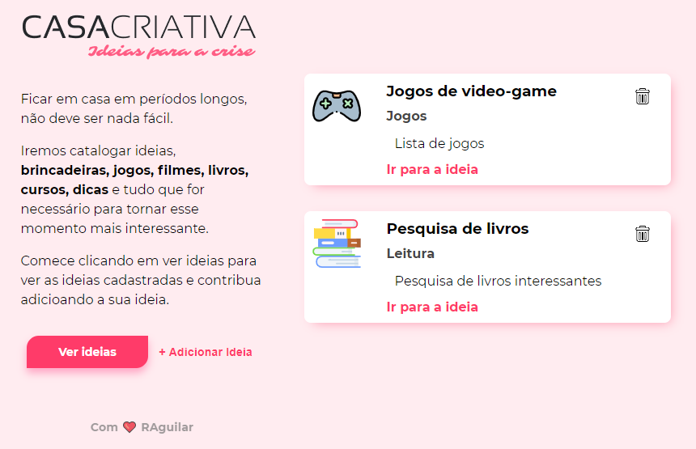
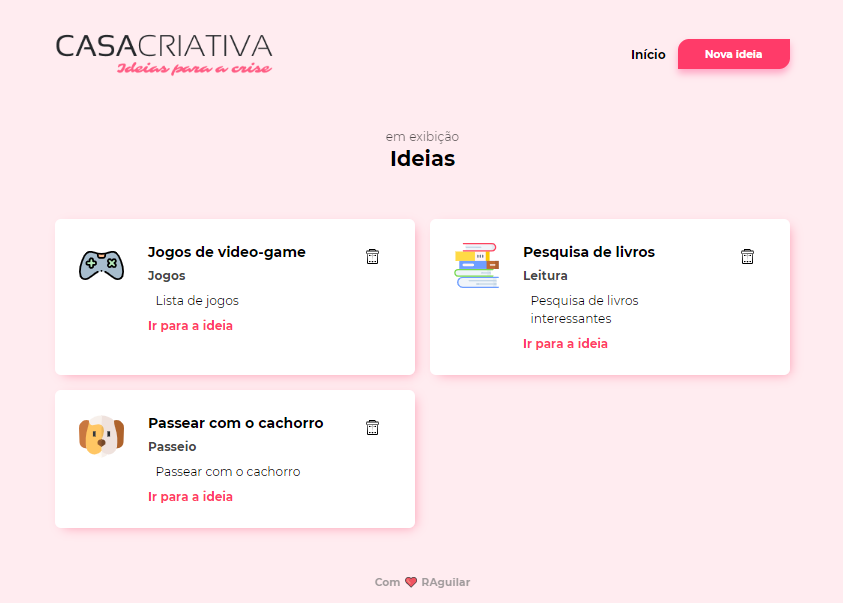
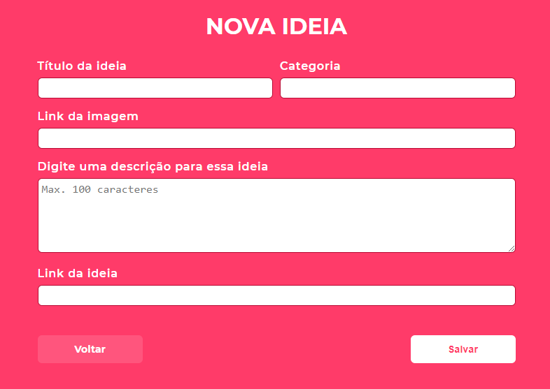

<strong>WorkshopDev Especial</strong> 

Página de web criada com HTML, CSS e Javascript para armazenar sugestões de atividades que podem ser realizadas durante a quarentena. 

Foram utilizados express, nunjucks, nodemon, SQLite, node.js.

